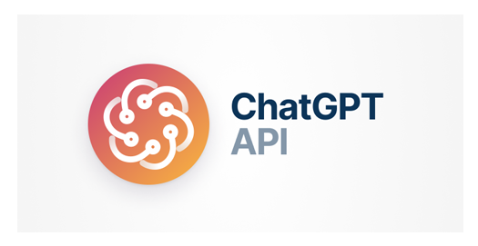

# ChatGPT-Application-Project

## Introduction:

This notebook mainly uses ChatGPT from the langchain library to perform some tasks such as: Text Classification, Machine Translation, Question Answering, Conversation, Reasoning, Coding Application.

## Content:
This notebook includes the following main part:
- ChatGPT Basic
- ChatGPT using langchain library
- ChatGPT application
- ChatGPT Limitation
## Run:
- Download notebook ChatGPT-Application.ipynb
- Run each cell from top to bottom to perform training
